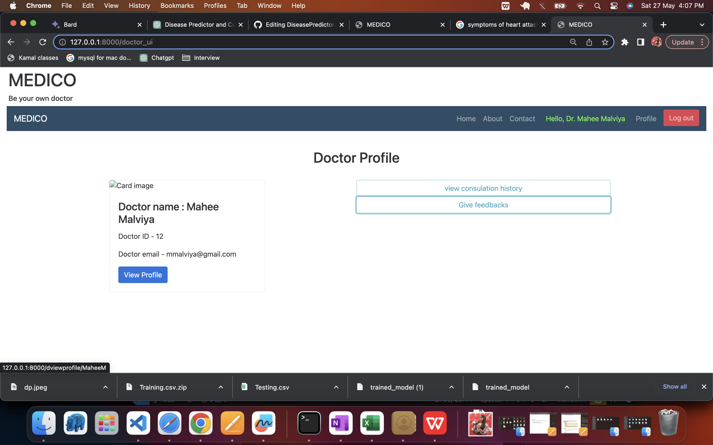

# DiseasePredictor
Disease Predictor and Consultation System is a Web application designed to allows patients to input their symptoms and receive accurate disease predictions. It features authentication for doctors, patients, and admins, enabling patients to connect with doctors for consultations, engage in real-time chats, and rate doctors based on their experience and doctors can also communicate with the patient and assist on the basis of symptoms and predicted disease.

(developed using Machine Learning, Python, Django, SQLite, HTML, and CSS)

Key Features
Disease Prediction: The system utilizes a trained Machine Learning model, specifically a Naive Bayes classifier, to predict diseases based on user-input symptoms. This provides patients with accurate disease predictions and helps them understand potential health conditions.

Authentication: The system provides authentication functionality for doctors, patients, and admins. Users can create accounts, log in securely, and access personalized features based on their roles.

Real-time Communication: A real-time chat feature is implemented, allowing patients and doctors to engage in private conversations. This fosters effective communication, enables patients to ask questions, and helps doctors provide timely advice and guidance.

Rating System: Patients have the ability to rate doctors based on their consultation experiences. This rating system ensures transparency and accountability, helping other patients make informed decisions when choosing a healthcare professional.

Database Integration: The system securely stores patient and doctor information in an SQLite database. This includes user profiles, symptoms, disease predictions, and consultation history, facilitating easy access to past records and ensuring data confidentiality.

1. MainLandingPage

2. SignupAsPage

3. SigninAspage

4. AdminSigninPage

5. DoctorSignupPage

6. DoctorSigninPage

7. PatientSignupPage

8. PatientSigninPage

9. LandingPageAfterPatientLogin

10. ViewProfileofPatient

11. CheckDiseasePage

12. PredictionResult

13. ConsultDoctor

14. ConsultationPage1

15. ConsultationPage2

16. Rating

17. Review

18. ConsultationHistoryPage

19. DoctorLandingPage
